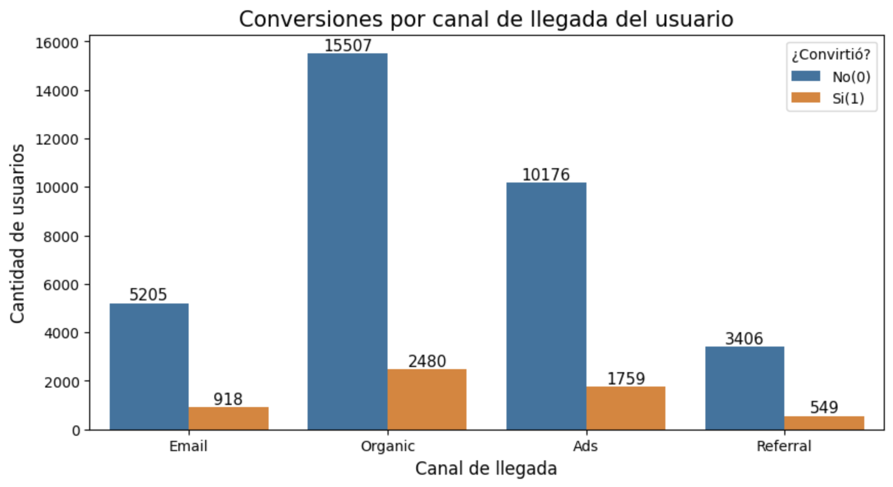
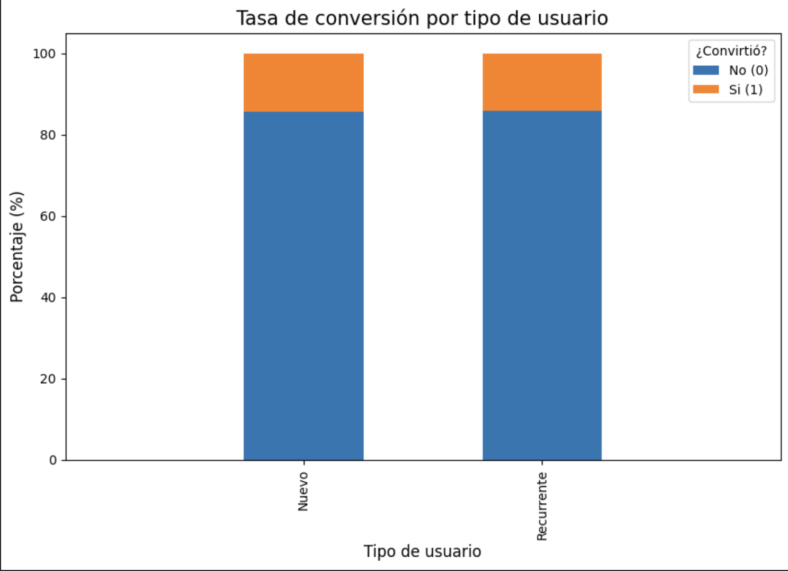

# 🧪 A/B Testing: Landing Page Performance

[](https://www.python.org/)
[](https://jupyter.org/)
[](https://pandas.pydata.org/)
[](https://numpy.org/)
[](https://scipy.org/)
[](https://www.statsmodels.org/)
[](https://matplotlib.org/)
[](https://seaborn.pydata.org/)

## 📌 Descripción del proyecto

Una empresa de comercio electrónico busca determinar si una nueva versión de su **Landing Page** mejora el comportamiento de los usuarios frente a la versión actual.

Se realizó un **experimento A/B con 40,000 usuarios**, distribuidos entre dos variantes:

* **Versión A:** experiencia actual.
* **Versión B:** nueva propuesta de Landing Page.

El análisis busca determinar si la variante B genera una mejora estadísticamente significativa en la **tasa de conversión** y en el **gasto promedio por cliente**, además de explorar el comportamiento según diferentes fuentes de tráfico y tipos de usuario.

El objetivo final es proporcionar evidencia cuantitativa para decidir si la nueva versión debe implementarse de forma definitiva.

---
## 🔑 Key Takeaways

- 📈 **+3.39 puntos porcentuales** en tasa de conversión con la Versión B.
- 🚀 **+27.0% de incremento relativo** en conversión.
- 💰 **+$7.66 de gasto promedio** por cliente con la Versión B.
- 📊 La diferencia en conversión y gasto promedio fue **estadísticamente significativa (p < 0.001)**.
- 📩 **Email** presentó la mayor tasa de conversión entre las fuentes de tráfico analizadas.
- 👥 No se encontró evidencia estadísticamente significativa de asociación entre tipo de usuario y conversión.
---
## 🎯 Objetivos de negocio

### 1. Evaluar la conversión

Determinar si la versión B genera una tasa de conversión significativamente mayor que la versión A.

### 2. Evaluar el impacto económico

Analizar si existe una diferencia estadísticamente significativa en el gasto promedio de los usuarios convertidos entre ambas variantes.

### 3. Analizar segmentos de usuarios

Explorar si la conversión presenta diferencias o asociaciones relevantes según:

* Fuente de tráfico.
* Tipo de usuario: nuevo vs. recurrente.

### 4. Formular una recomendación

Utilizar los resultados estadísticos para determinar qué variante ofrece un mejor desempeño y proporcionar una recomendación de negocio.

---

## 📊 Dataset

El experimento contiene información de **40,000 usuarios**, distribuidos de manera equilibrada entre ambas variantes.

| Variante | Usuarios | Conversiones | Tasa de conversión |
| -------- | -------: | -----------: | -----------------: |
| A        |   19,982 |        2,512 |             12.57% |
| B        |   20,018 |        3,194 |             15.96% |

Las principales variables utilizadas incluyen información sobre:

* Variante del experimento.
* Conversión.
* Gasto.
* Fuente de tráfico.
* Tipo de usuario.
* Características demográficas.

---

## 🔬 Metodología

El análisis combina **estadística inferencial, análisis exploratorio y segmentación** para evaluar el desempeño de las dos variantes.

### Prueba Z de proporciones

Se utilizó para comparar las tasas de conversión entre las versiones A y B.

**Hipótesis:**

* **H₀:** Las tasas de conversión de A y B son iguales.
* **H₁:** Las tasas de conversión de A y B son diferentes.

### Prueba T de Student

Se utilizó para comparar el gasto promedio de los usuarios convertidos entre ambas variantes.

**Hipótesis:**

* **H₀:** El gasto promedio es igual entre A y B.
* **H₁:** Existe una diferencia en el gasto promedio.

### Prueba Chi-cuadrada

Se utilizó para evaluar si existe una asociación entre la **fuente de tráfico** y la conversión.

### Prueba exacta de Fisher

Se utilizó como análisis complementario para evaluar la asociación entre **tipo de usuario** y conversión.

---

## 📈 Principales resultados

### 1. La versión B mejora significativamente la conversión

| Métrica      |  Versión A |  Versión B |
| ------------ | ---------: | ---------: |
| Usuarios     |     19,982 |     20,018 |
| Conversiones |      2,512 |      3,194 |
| Conversión   | **12.57%** | **15.96%** |

La variante B presenta una mejora de:

**+3.39 puntos porcentuales**

Esto representa aproximadamente un:

**+27.0% de incremento relativo en la tasa de conversión.**

La prueba Z obtuvo:

* **Z = -9.677**
* **p < 0.001**

Por lo tanto, existe evidencia estadísticamente significativa para **rechazar la hipótesis nula**.

**Interpretación:** la diferencia observada entre las tasas de conversión de ambas variantes es muy poco probable bajo el supuesto de que ambas tuvieran el mismo desempeño.

---

### 2. La versión B también presenta un mayor gasto promedio

| Métrica        |  Versión A |  Versión B |
| -------------- | ---------: | ---------: |
| Gasto promedio | **$61.09** | **$68.75** |

La diferencia observada es de aproximadamente:

**+$7.66 por cliente**

El incremento relativo es de aproximadamente:

**+12.5%**

La prueba T obtuvo:

* **t = -9.366**
* **p < 0.001**

Los resultados proporcionan evidencia estadísticamente significativa de una diferencia en el gasto promedio entre ambas variantes.

**Interpretación:** la variante B no solamente presenta una mayor proporción de usuarios convertidos, sino que los usuarios convertidos también muestran un mayor gasto promedio.

---

### 3. La fuente de tráfico presenta asociación con la conversión

Las tasas de conversión observadas por fuente de tráfico muestran diferencias entre los canales.

| Fuente de tráfico | Tasa de conversión |
| ----------------- | -----------------: |
| Email             |         **14.99%** |
| Ads               |         **14.74%** |
| Organic           |         **13.79%** |

El tráfico orgánico representa el mayor volumen absoluto de usuarios y conversiones, mientras que **Email** presenta la mayor tasa de conversión.

La prueba Chi-cuadrada obtuvo:

**p = 0.034**

Con un nivel de significancia de α = 0.05, existe evidencia de una asociación estadísticamente significativa entre la fuente de tráfico y la conversión.

---

### 4. El tipo de usuario no presenta evidencia de asociación significativa

Se analizó la relación entre el tipo de usuario y la conversión mediante una prueba exacta de Fisher.

Resultado:

**p = 0.472**

Al ser mayor que α = 0.05, no existe evidencia estadísticamente significativa para afirmar que el tipo de usuario esté asociado con la conversión en este experimento.

Este resultado también es relevante: **no todas las variables analizadas presentan diferencias estadísticamente significativas**, lo que permite evitar conclusiones basadas únicamente en diferencias descriptivas.

---

## 📈 Visualizaciones

A continuación se muestran las gráficas más representativas del análisis. El resto de las visualizaciones (Graficas de Barras por Conversión por Cantidad de Usuarios y Tasa de Conversión) se puede consultar directamente en el notebook.

### Conversiones por Canal



El canal Organic es presenta un mayor tráfico de usuarios, además de una cantidad mayor de usuarios que convierten, y siendo Referral el canal que tiene un menor tráfico de usuarios y de personas que convierten consistente con la estadística que nos dice que la fuente de tráfico está directamente relacionada con la conversión


### Tasa de Conversión por Tipo de Usuario



Las tasas de conversión de cada canal donde se observa que todos los canales tienen una tasa de conversión muy similar, no se observa una diferencia a simple vista consistente con el p-value obtenido por la prueba de Fisher.

--- 
## 💡 Recomendación de negocio

Los resultados favorecen a la **Versión B de la Landing Page**.

La variante B presenta:

* Una tasa de conversión **3.39 puntos porcentuales mayor**.
* Aproximadamente **27% más conversión en términos relativos**.
* Un gasto promedio aproximadamente **12.5% mayor**.
* Diferencias estadísticamente significativas tanto en conversión como en gasto promedio.

Por lo tanto, **se recomienda implementar la Versión B como nueva experiencia principal de la Landing Page**, considerando los resultados obtenidos durante el experimento.

Además, los resultados sugieren prestar especial atención a las fuentes de tráfico, particularmente a **Email y Ads**, debido a sus mayores tasas de conversión observadas.

---

## 📊 Visualizaciones

Las principales visualizaciones del análisis estarán disponibles en la carpeta `images/` e incluirán:

* Comparación de tasa de conversión entre A y B.
* Comparación del gasto promedio.
* Conversión por fuente de tráfico.
* Visualizaciones complementarias del comportamiento de los usuarios.

---

## 🛠️ Tecnologías utilizadas

### Lenguaje y entorno

* Python
* Jupyter Notebook

### Manipulación y análisis

* Pandas
* NumPy

### Estadística

* SciPy
* Statsmodels

### Visualización

* Matplotlib
* Seaborn

---

## 📁 Estructura del repositorio

```text
A-B-Testing/
│
├── A-B-Testing.ipynb
├── README.md
├── requirements.txt
├── .gitignore
│
└── images/
    ├── Conversiones_canal.png
    ├── Tasa_llegada.png
    └── Tasa_usuario.png
```

---

## 🚀 Cómo ejecutar el proyecto

### 1. Clonar el repositorio

```bash
git clone https://github.com/JorgeCeronDA/A-B-Testing.git
cd A-B-Testing
```

### 2. Crear un entorno virtual

```bash
python -m venv .venv
```

Activar el entorno:

**macOS / Linux**

```bash
source .venv/bin/activate
```

**Windows**

```bash
.venv\Scripts\activate
```

### 3. Instalar las dependencias

```bash
pip install -r requirements.txt
```

### 4. Ejecutar el notebook

```bash
jupyter notebook
```

Abrir:

```text
A-B-Testing.ipynb
```

---

## 📌 Conclusión

Este proyecto demuestra el uso de **experimentación A/B y estadística inferencial para resolver un problema de negocio**, combinando análisis exploratorio, pruebas de hipótesis y segmentación de usuarios.

El análisis permite pasar de una comparación descriptiva entre dos variantes a una **decisión respaldada estadísticamente**, identificando tanto resultados significativos como variables donde no existe evidencia suficiente de una diferencia.

---

## 👤 Autor

**Jorge Cerón**
Data Analyst | Python · SQL · Power BI · Excel

[GitHub](https://github.com/JorgeCeronDA)
